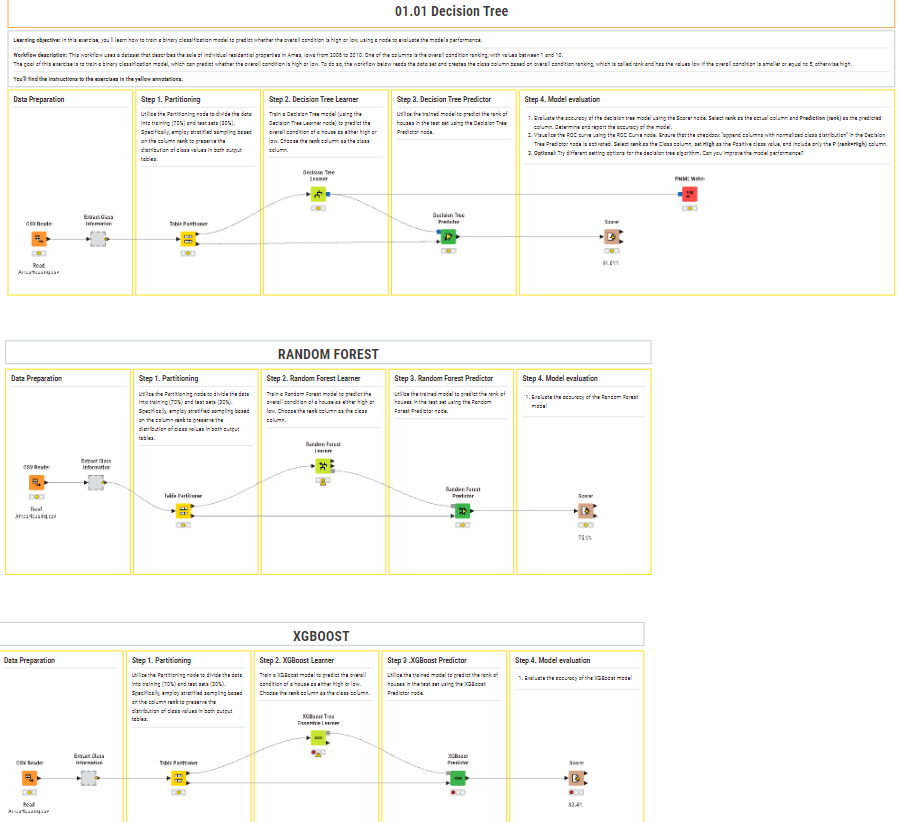

# 📊 Data Science & ETL Workflows (KNIME)

This repository contains professional workflows developed in **KNIME Analytics Platform**. These projects demonstrate my ability to process, transform, and analyze data using a visual programming approach.

## 🚀 Featured Workflows

### 1. [Predictive Modeling: Student Mental Health Analysis]
**Objective:** Developed a predictive workflow to identify potential cases of depression in students based on behavioral and academic indicators.
- *Key Stages of the Workflow:**
1. **Data Preprocessing:** Handled missing values, normalized numerical features, and applied One-Hot Encoding to categorical variables.
2. **Exploratory Data Analysis (EDA):** Identified key correlations between lifestyle factors and mental health outcomes.
3. **Model Training:** Implemented a **Logistic Regression** algorithm, partitioning the data (70/30) for robust training and testing.
4. **Evaluation:** Achieved an 84.5% accuracy rate, validated through Confusion Matrix and ROC Curve analysis.

**Technical Insight:** Even though the project used a synthetic dataset for architectural testing, the workflow is fully scalable and ready to be deployed with real-world institutional data.

**Technical Tools Used:**
**KNIME Nodes:** Row Filter, Partitioning, Logistic Regression Learner, Scorer.
**Concepts:** Data Normalization, Binary Classification, Performance Metrics.

### 2. [🏠 Real Estate Price Prediction: Ames Housing Analysis]
**Models Compared:** Decision Tree, Random Forest, and XGBoost.
**Winner:** XGBoost (82.4% Accuracy)

**Objective:** Perform a comparative analysis to find the best model for predicting house prices.

**Model Benchmarking & Insights:**
* **Decision Tree:** Achieved **81.8%**, providing a clear, interpretable baseline.
* **Random Forest:** Achieved **75.9%**. *Insight:* The lower performance here suggested that the forest required more hyperparameter tuning or that the data had specific patterns better captured by boosting.
* **XGBoost:** The top performer with **82.4%**. By using Gradient Boosting, I was able to minimize the residuals that the simpler models missed.

**Key Technical Skill:** This experiment demonstrates my ability to conduct **Hyperparameter Testing** and **Algorithm Selection**, ensuring the most efficient model is deployed for the specific business problem.

## 🎯 Conclusion
My experience with KNIME allows me to tackle diverse data challenges, from **Classification** (Logistic Regression for Mental Health) to **Advanced Regression** (XGBoost for Real Estate). I focus on the entire data lifecycle: from messy raw data to validated, high-accuracy predictive models.
